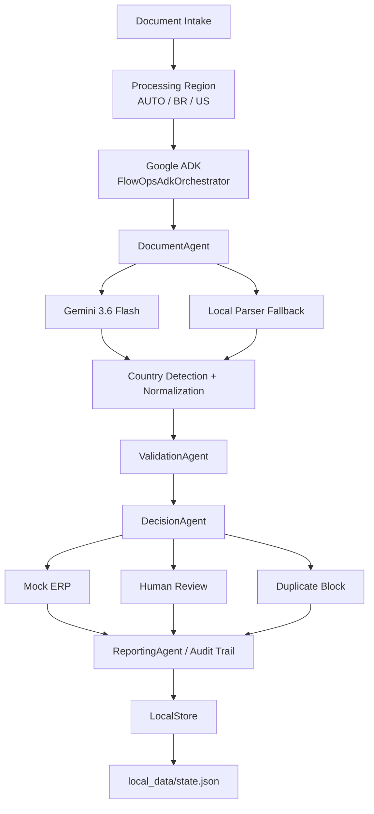

# FlowOps AI

FlowOps AI is an agentic document operations platform that processes business documents across multiple markets using Google ADK and Gemini.

The current implementation supports two markets:

- Brazil
- United States

It follows one workflow, applies local document rules, and maps country-specific evidence into a universal operational model.

FlowOps AI is not a chatbot. It is an action-oriented workflow system for document operations.

## 1. Short Description

FlowOps AI is a multi-country agentic document operations system that receives business documents, detects regional context, extracts structured data with Gemini, validates country-specific rules, routes exceptions to Human Review, blocks duplicates, executes approved actions in a Mock ERP, and maintains a complete audit trail.

## 2. Problem

Businesses in different markets still handle core document operations manually. A typical operations team may need to:

- ingest documents from manual intake channels;
- extract data from PDFs;
- identify regional tax identifiers;
- validate required fields;
- detect duplicate invoices;
- enter approved data into an ERP;
- route incomplete or invalid documents to an employee;
- preserve a reliable audit trail.

The problem is not only reading a document. The harder operational problem is coordinating the full path from intake to decision, exception handling, and action.

## 3. Solution

FlowOps AI automates the current workflow end to end:

```text
Document Intake
-> Cloud Run / FastAPI
-> Processing Region
-> Google ADK
-> DocumentAgent
-> Gemini / Local Parser Fallback
-> Country Detection / Normalization
-> ValidationAgent
-> DecisionAgent
-> Mock ERP / Human Review / Duplicate Block
-> ReportingAgent / Audit Trail
-> Persistent State
```

The system processes uploaded PDF batches locally or through the hosted Cloud Run demo, extracts structured fields, normalizes localized values, validates regional rules deterministically, decides the next operational action, and records the result in the dashboard and persistent audit trail.

## 4. Hackathon Track

Track: **Taskmaster**

FlowOps AI fits the Taskmaster track because it coordinates a multi-step operational workflow and performs concrete actions: registering approved records in a Mock ERP, blocking duplicates, escalating exceptions, and preserving auditability.

## 5. Core Capabilities

Implemented in the current Multi-Country RC:

- public hackathon demo on Google Cloud Run;
- PDF upload through the web dashboard;
- batch processing with one job containing multiple documents;
- Processing Region selection: Auto Detect, Brazil, United States;
- Gemini structured extraction through `google-genai`;
- Gemini API key injection through Google Secret Manager in Cloud Run;
- deterministic local parser fallback;
- PDF text extraction through `pypdf`;
- country detection and normalization;
- BR/CNPJ and US/EIN document handling;
- BRL and USD currency handling;
- country-aware validation;
- retry handling for selected recoverable validation failures;
- editable Human Review with universal fields;
- Human Review approve/reject operations;
- global Human Review queue;
- duplicate invoice detection;
- cross-country deduplication;
- cross-job deduplication;
- deterministic batch ordering in the web upload path;
- duplicate blocking before Mock ERP registration;
- Mock ERP registration for approved documents;
- global Mock ERP view;
- Job History;
- per-job dashboard;
- audit trail events;
- persistent local state in JSON;
- atomic state writes with backup/recovery;
- FastAPI API and static web dashboard;
- Dockerfile and `.dockerignore` for Cloud Run deployment;
- real multipart endpoint regression tests.

## 6. Multi-Country Document Intelligence

FlowOps AI supports country-aware document processing through a Processing Region control:

- **Auto Detect**
- **Brazil**
- **United States**

When Processing Region is set to Auto Detect, FlowOps resolves the document context from evidence in the document before applying regional rules.

### Brazil

Brazilian document handling currently supports:

- CNPJ;
- BRL;
- Brazilian date and document conventions;
- Brazilian invoice labels such as nota fiscal references.

### United States

United States document handling currently supports:

- EIN / Tax ID;
- USD;
- US invoice labels;
- US date conventions.

Brazil and the United States are the implemented markets in the current version. Additional markets are future policy packs, not current runtime support.

## 7. Universal Document Model

Localized fields are represented through a universal model. Relevant fields include:

```text
country_code
country_confidence
company_name
tax_id
tax_id_type
normalized_tax_id
invoice_number
normalized_invoice_number
issue_date
total_amount
currency
document_type
confidence
```

CNPJ and EIN are local representations inside this universal model:

- Brazil uses `tax_id_type = CNPJ`;
- United States uses `tax_id_type = EIN`.

### Examples

Brazil:

```text
country_code: BR
tax_id_type: CNPJ
currency: BRL
```

United States:

```text
country_code: US
tax_id_type: EIN
currency: USD
```

These examples are illustrative and do not contain real business data.

## 8. Country-Aware Validation

Validation is deterministic and country-aware.

Brazil:

- validates required fields;
- validates CNPJ format/structure;
- applies Brazil-oriented date and currency expectations.

United States:

- validates required fields;
- validates basic structural EIN format;
- applies US-oriented date and currency expectations.

The current US validation is structural. It does not claim official IRS verification.

Validation also covers, as applicable:

- company name;
- tax id;
- invoice number;
- issue date;
- total amount;
- country;
- currency;
- confidence.

## 9. Auto Detect

When Processing Region is set to Auto Detect, FlowOps resolves country context from document evidence before applying regional rules.

Signals may include:

- CNPJ;
- EIN;
- BRL;
- USD;
- language;
- invoice labels;
- date patterns.

Auto Detect is designed to choose between the currently implemented markets: Brazil, United States, or Unknown. Unknown or incomplete documents are routed to Human Review when validation cannot pass.

## 10. Normalization

Localized values are normalized into a universal operational representation.

Examples:

```text
BR date: 23/08/2026 -> 2026-08-23
US date: 08/23/2026 -> 2026-08-23
```

CNPJ, EIN, and invoice numbers are also normalized for stable deduplication.

## 11. Architecture



Current implementation includes the FastAPI application, Google ADK orchestration, Gemini 3.6 Flash extraction, local parser fallback, multi-country BR/US policy handling, Human Review, Duplicate Protection, Mock ERP, Audit Trail, LocalStore persistence, and a public Cloud Run hackathon demo.

Firestore, Cloud Storage, and Pub/Sub are not part of the current runtime.

## 12. Live Demo

URL:

```text
https://flowops-ai-vns7icztma-rj.a.run.app
```

The hackathon MVP is deployed on Google Cloud Run. The hosted demo uses the same FastAPI application, Google ADK workflow, Gemini extraction path, country-aware validation, Human Review, Duplicate Protection, Mock ERP, and Audit Trail described in this README.

This public demo does not claim production-grade persistent storage. It still uses LocalStore on the Cloud Run instance filesystem, which can be reset when the instance restarts.

## 13. Google Technologies

### Gemini

- Model: `gemini-3.6-flash`
- SDK: `google-genai` 2.18.1 in the validated local environment
- Integration path: `tools/documents/gemini_extractor.py`
- Runtime usage: structured document extraction and country-aware document understanding

The DocumentAgent extracts PDF text, sends it to Gemini, and expects structured JSON aligned with the universal model. If Gemini is unavailable, returns invalid JSON, hits quota, times out, or fails with an API error, FlowOps records `LOCAL_PARSER_FALLBACK` and continues with the deterministic parser.

Cloud validation successfully used Gemini extraction for one valid United States invoice and one valid Brazilian invoice, both without fallback.

### Google Agent Development Kit (ADK)

- Package: `google-adk` 2.7.1 in the validated local environment
- Model: `gemini-3.6-flash`
- Orchestrator path: `agents/adk/orchestrator.py`

`FlowOpsAdkOrchestrator` is part of the real job execution path. It records `ADK_WORKFLOW_STARTED`, confirms the ADK runtime when available, runs the existing agents, and records `ADK_WORKFLOW_COMPLETED`. If the ADK model acknowledgement fails with a recoverable quota error, the workflow continues safely and records `ADK_ORCHESTRATOR_UNAVAILABLE`.

### Google Cloud Deployment

The public hackathon demo is deployed on Google Cloud Run:

- Service: `flowops-ai`;
- Region: `southamerica-east1`;
- scale-to-zero enabled;
- maximum instances: 1;
- public demo URL: `https://flowops-ai-vns7icztma-rj.a.run.app`;
- `GEMINI_API_KEY` is stored in Google Secret Manager and injected into Cloud Run at runtime.

No project secrets, billing details, account emails, or service-account credentials are documented in this repository.

### Secret Manager

In the Cloud Run demo:

```text
GEMINI_API_KEY
-> Google Secret Manager
-> Cloud Run runtime environment
```

The secret value is never committed and is not printed by the application.

## 14. Agent Workflow

### DocumentAgent

- Input: a queued document with a local storage path.
- Responsibility: extract raw PDF text, call Gemini, use fallback when needed, detect/normalize country context, and produce structured fields.
- Output: an `Extraction` record.
- Main events: `PDF_TEXT_EXTRACTED`, `GEMINI_EXTRACTION` or `LOCAL_PARSER_FALLBACK`, `COUNTRY_DETECTED`, `DOCUMENT_NORMALIZED`, and `EXTRACTION_COMPLETED`.

### ValidationAgent

- Input: an `Extraction`.
- Responsibility: validate required fields, regional tax id structure, invoice number, issue date, total amount, country, currency, confidence, and duplicate indicators.
- Output: a validation dictionary with `status`, `errors`, `warnings`, `retry_recommended`, and `human_review_recommended`.
- Main event: `VALIDATION_COMPLETED`.

### DecisionAgent

- Input: document, extraction, and validation result.
- Responsibility: decide whether to retry, send to Human Review, block a duplicate, or register the document in the Mock ERP.
- Output: a decision string such as `APPROVED`, `DUPLICATE_BLOCKED`, or `HUMAN_REVIEW_REQUIRED`.
- Main events: `DECISION_RETRY`, `DECISION_HUMAN_REVIEW`, `DUPLICATE_DETECTED`, or `DECISION_APPROVED`.

### ReportingAgent

- Input: a job id.
- Responsibility: refresh job metrics and provide dashboard/report data.
- Output: dashboard or report data.
- Main events: `JOB_METRICS_UPDATED` and, when requested, `REPORT_GENERATED`.

## 15. Human Review

Documents with unresolved validation problems are routed to the global Human Review queue.

The operator can view and edit universal fields:

- Country;
- Company;
- Tax ID Type;
- Tax ID;
- Invoice Number;
- Issue Date;
- Total Amount;
- Currency.

When the operator corrects and approves a review, FlowOps re-runs `ValidationAgent`. Only valid corrected data can continue to `DecisionAgent` and the Mock ERP. Invalid corrections remain in Human Review with updated errors. Rejections become `REJECTED` and are not sent to the ERP.

The Human Review queue is global. A review created in an older job remains accessible even after newer jobs are processed.

## 16. Duplicate Protection

FlowOps uses the country-aware business key:

```text
country_code + normalized_tax_id + normalized_invoice_number
```

This prevents a Brazilian CNPJ invoice and a United States EIN invoice from colliding incorrectly.

The first registered invoice for a unique business key becomes the original. Later documents with the same key are marked:

```text
DUPLICATE_BLOCKED
```

The audit trail records:

```text
DUPLICATE_DETECTED
```

Duplicate records are not sent to the Mock ERP again. The duplicate event includes:

- `original_job_id`;
- `original_document_id`;
- `original_erp_record_id`;
- original and current total amount.

This works within the same job, across jobs, across the BR/US identity model, and after restarting the local API as long as `local_data/state.json` is preserved.

## 17. Mock ERP

The current ERP integration is a Mock ERP, not a production ERP.

Mock ERP Global supports approved records from Brazil and the United States. The dashboard exposes:

- Invoice;
- Tax ID;
- Type;
- Country;
- Amount;
- Currency.

Approved documents create Mock ERP records. Human Review documents, rejected documents, and duplicate-blocked documents do not create duplicate ERP records.

## 18. Resilience

FlowOps currently includes local MVP resilience, not enterprise infrastructure:

- Gemini/API/quota failures -> `LOCAL_PARSER_FALLBACK`;
- fallback parser supports the documented BR and US scenarios;
- ADK recoverable quota failure -> `ADK_ORCHESTRATOR_UNAVAILABLE`, then the workflow continues;
- local state writes use an atomic temp-file replacement;
- `LocalStore` uses a process-local `RLock`;
- a valid `state.json` is copied to `state.json.bak`;
- if `state.json` is missing or invalid, controlled recovery can load from `state.json.bak`.

These mechanisms are suitable for the Multi-Country RC hackathon demo, not a multi-process production deployment.

## 19. Persistence

Current state file:

```text
local_data/state.json
```

Backup file:

```text
local_data/state.json.bak
```

Persisted data:

- counters;
- jobs;
- documents;
- extractions;
- events;
- human_reviews;
- erp_records.

Uploaded PDFs are stored under:

```text
local_data/uploads/
```

`local_data/` is ignored by Git and is intended for local demo/runtime data.

In the hosted Cloud Run demo, this same LocalStore/state.json persistence model runs on the ephemeral Cloud Run filesystem. State can be lost when the instance restarts, scales down, or is redeployed. For the hackathon demo this is a known limitation.

Production target persistence remains:

- Firestore for operational state;
- Cloud Storage for uploaded documents.

## 20. Project Structure

```text
apps/
  api/
    main.py
    processor.py
  web/
    index.html
    app.js
    styles.css

agents/
  adk/
  decision/
  document/
  intake/
  reporting/
  validation/

tools/
  documents/
    extractor.py
    gemini_extractor.py
    normalization.py
  erp/
  reporting/
  validation/

shared/
  models/

scripts/
  adk_smoke_test.py
  gemini_extract_test.py
  gemini_smoke_test.py

sample_data/
  alfa_contabilidade/

tests/
  test_multi_country.py
  test_persistence.py
  test_vertical_slice.py

docs/

Dockerfile
.dockerignore
```

## 21. Requirements

Validated local runtime:

- Python 3.14.3 on Windows.

Main dependencies from the current environment and `requirements.txt`:

- FastAPI;
- Uvicorn;
- Pydantic;
- python-multipart;
- pypdf;
- reportlab;
- google-genai;
- google-adk.

Install the project dependency set from:

```text
requirements.txt
```

## 22. Environment Setup

### Windows PowerShell

```powershell
git clone <your-repository-url>
cd flowops-ai
python -m venv .venv
.\.venv\Scripts\Activate.ps1
python -m pip install --upgrade pip
python -m pip install -r requirements.txt
```

### macOS / Linux

```bash
git clone <your-repository-url>
cd flowops-ai
python3 -m venv .venv
source .venv/bin/activate
python -m pip install --upgrade pip
python -m pip install -r requirements.txt
```

## 23. Environment Variables

Create a local `.env` file from `.env.example` and set:

```text
GEMINI_API_KEY=
```

Never commit real secrets.

`.gitignore` includes:

```text
.env
local_data/
.venv/
```

Local development uses `.env`. The hosted Cloud Run demo uses Google Secret Manager for `GEMINI_API_KEY` instead of a committed environment file.

## 24. Running FlowOps

Start the local FastAPI application:

```powershell
.\.venv\Scripts\python.exe -m uvicorn apps.api.main:app --host 127.0.0.1 --port 8080
```

For development with reload:

```powershell
.\.venv\Scripts\python.exe -m uvicorn apps.api.main:app --reload --host 127.0.0.1 --port 8080
```

Open:

```text
http://127.0.0.1:8080/
```

Health endpoint:

```text
http://127.0.0.1:8080/health
```

## 25. Running Tests

Run the full test suite:

```powershell
.\.venv\Scripts\python.exe -m unittest discover -s tests
```

Current Multi-Country validation:

```text
72 tests passing
```

Coverage includes:

- BR processing;
- US processing;
- Auto Detect;
- country-aware validation;
- universal Human Review fields;
- global Human Review queue;
- batch upload;
- real multipart endpoint behavior;
- deterministic batch ordering;
- duplicate blocking;
- cross-country identity;
- persistence and recovery;
- Gemini fallback;
- Mock ERP;
- audit trail.

Validated Cloud Run scenarios:

```text
US valid invoice -> REGISTERED / US / EIN / USD / GEMINI_EXTRACTION
BR valid invoice -> REGISTERED / BR / CNPJ / BRL / GEMINI_EXTRACTION
```

## 26. Demo Workflow

A juror can reproduce the local demo as follows:

1. Start the FastAPI server.
2. Open `http://127.0.0.1:8080/`.
3. Choose Processing Region: **Auto Detect**, **Brazil**, or **United States**.
4. Upload a Brazilian or United States invoice PDF.
5. Observe detected country context in the document row.
6. Observe Gemini extraction or fallback events in the audit trail.
7. Confirm validation and decision results.
8. Check Mock ERP for approved documents or Human Review for exceptions.
9. Upload a duplicate invoice.
10. Confirm the later document becomes `DUPLICATE_BLOCKED`.

For batch testing, upload a BR or US batch in one request and inspect Job History, global Human Review, global Mock ERP, and the audit trail.

## 27. Sample Data

Bundled sample files currently published in the repository are under:

```text
sample_data/alfa_contabilidade/
```

Current published sample files:

```text
NF001.pdf
NF002_RETRY.pdf
NF003_HUMAN_REVIEW.pdf
NF004.pdf
NF005.pdf
```

These are the sample documents currently committed to the repository. The US manual acceptance PDFs used during local testing are not currently published as repository sample data.

## 28. API Endpoints

Important endpoints implemented in `apps/api/main.py`:

```text
GET  /
GET  /health
POST /dev/reset
POST /jobs/demo
POST /jobs/demo/run
POST /jobs/upload/run
GET  /jobs
GET  /jobs/{job_id}
POST /jobs/{job_id}/run
GET  /jobs/{job_id}/events
GET  /jobs/{job_id}/dashboard
GET  /jobs/{job_id}/report
GET  /human-reviews
POST /human-reviews/{review_id}/resolve
POST /human-reviews/{review_id}/reject
GET  /erp-records
GET  /demo/sample-files
```

`POST /dev/reset` is available for local development by default and is disabled in production through `APP_ENV=production`.

## 29. Auditability

FlowOps records agent events as part of the persisted state. Important event types include:

- `JOB_CREATED`;
- `DOCUMENT_QUEUED`;
- `ADK_WORKFLOW_STARTED`;
- `ADK_ORCHESTRATOR_READY`;
- `ADK_ORCHESTRATOR_UNAVAILABLE`;
- `ADK_WORKFLOW_FAILED`;
- `ADK_WORKFLOW_COMPLETED`;
- `EXTRACTION_STARTED`;
- `PDF_TEXT_EXTRACTED`;
- `GEMINI_EXTRACTION`;
- `LOCAL_PARSER_FALLBACK`;
- `COUNTRY_DETECTED`;
- `DOCUMENT_NORMALIZED`;
- `EXTRACTION_COMPLETED`;
- `VALIDATION_COMPLETED`;
- `DECISION_RETRY`;
- `DECISION_APPROVED`;
- `DECISION_HUMAN_REVIEW`;
- `HUMAN_REVIEW_CORRECTED`;
- `HUMAN_REVIEW_APPROVED`;
- `HUMAN_REVIEW_REJECTED`;
- `DUPLICATE_DETECTED`;
- `JOB_METRICS_UPDATED`;
- `REPORT_GENERATED`.

Events include safe metadata such as job id, document id, agent name, event type, message, timestamp, and event data. Secrets are not intentionally logged.

## 30. Current Limitations

Current Multi-Country RC limitations:

- currently supports Brazil and the United States only;
- Mock ERP only; no production ERP integration yet;
- local JSON persistence only, including the current Cloud Run demo filesystem;
- process-local write lock only; not safe for multiple Uvicorn workers writing the same state file;
- uploaded PDFs are stored locally;
- Gemini quota or API failures can trigger local fallback;
- no automatic Gmail, Outlook, or WhatsApp ingestion yet;
- no production authentication/authorization layer yet;
- no Firestore, Cloud Storage, or Pub/Sub runtime integration yet;
- local parser fallback covers documented BR/US scenarios but is not a full fiscal-document extraction engine.

## 31. Production Architecture / Roadmap

Future production targets, not implemented in the current Multi-Country RC:

- Gmail intake;
- Outlook intake;
- WhatsApp Business intake;
- API intake hardening;
- Firestore persistence;
- Cloud Storage for uploaded documents;
- Pub/Sub queues for asynchronous processing;
- production ERP integrations;
- multi-tenant workspaces;
- authentication and role-based authorization;
- stronger observability, alerting, and security controls;
- additional country policy packs.

Brazil and the United States are current runtime markets. Additional countries are future work.

## 32. Security

Current security practices:

- Gemini API key is loaded from local environment configuration during local development.
- In Cloud Run, `GEMINI_API_KEY` is stored in Google Secret Manager and injected at runtime.
- `.env` is ignored by Git.
- `.env.example` contains placeholders only.
- API keys and secrets must not be committed.
- The README does not contain secrets.
- `/dev/reset` is disabled in production through `APP_ENV=production`.
- Local state and uploads are not publicly served by the FastAPI static file mount.

No compliance certification is claimed for the current release.

## 33. Hackathon Status

```text
Track: Taskmaster
Gemini: gemini-3.6-flash
Agent Framework: Google ADK 2.7.1
Google Cloud: Cloud Run
Secrets: Google Secret Manager
Current Version: FlowOps AI Multi-Country RC
Supported Markets: Brazil + United States
Tests: 72 passing
Hosted Demo: https://flowops-ai-vns7icztma-rj.a.run.app
```
