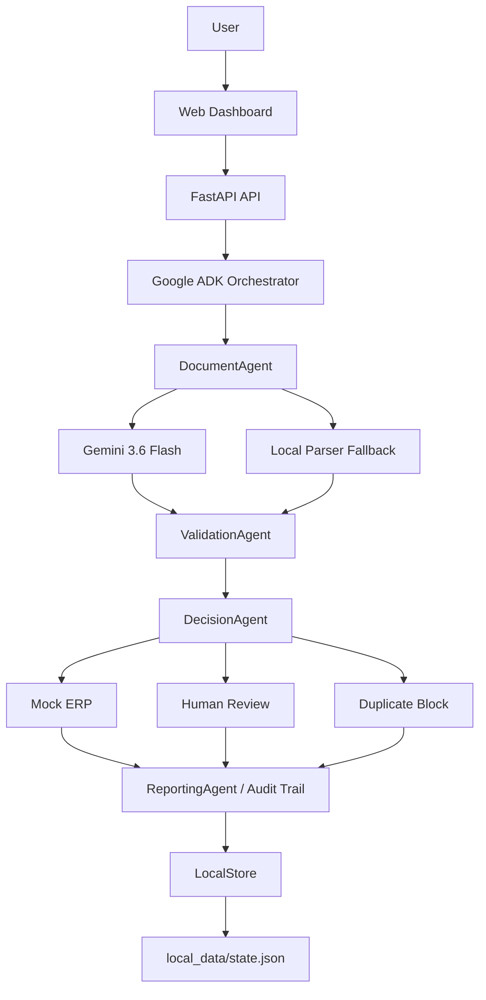

# FlowOps AI

FlowOps AI is an autonomous document operations workflow that receives business documents, extracts structured data with Gemini, validates business rules, makes operational decisions, routes exceptions to human review, blocks duplicate invoices, executes approved actions in a Mock ERP, and maintains a complete audit trail.

FlowOps AI is not a chatbot. It is an action-oriented workflow system for document operations.

## 1. Problem

Many businesses still process fiscal documents and invoices manually. A typical operations team has to:

- open incoming documents;
- read fiscal fields from PDFs;
- validate CNPJ, invoice number, issue date, and total amount;
- check whether an invoice was already registered;
- enter valid data into an ERP;
- route incomplete or invalid documents to an employee.

This creates repetitive work, operational delays, data-entry risk, and weak traceability. The problem is not only reading documents; it is coordinating the whole operational path from intake to action.

## 2. Solution

FlowOps AI automates the workflow end to end:

```text
Document Upload
-> Google ADK Orchestrator
-> DocumentAgent
-> Gemini extraction
-> ValidationAgent
-> DecisionAgent
-> Mock ERP OR Human Review OR Duplicate Block
-> ReportingAgent / Audit Trail
```

The system processes uploaded PDF batches, extracts structured invoice fields, validates them deterministically, decides the next operational action, and records the result in a dashboard and persistent audit trail.

## 3. Hackathon Track

Track: **Taskmaster**

FlowOps AI fits the Taskmaster track because it coordinates a multi-step operational workflow and performs concrete actions: registering approved records in a Mock ERP, blocking duplicates, escalating exceptions, and preserving auditability.

## 4. Core Capabilities

Implemented in the local RC1 release:

- PDF upload through the web dashboard;
- batch processing with one job containing multiple documents;
- Gemini structured extraction through `google-genai`;
- deterministic local parser fallback;
- PDF text extraction through `pypdf`;
- retry handling for selected recoverable validation failures;
- deterministic field validation;
- editable Human Review;
- Human Review approve/reject operations;
- global Human Review queue;
- duplicate invoice detection;
- cross-job deduplication;
- duplicate blocking before Mock ERP registration;
- Mock ERP registration for approved documents;
- global Mock ERP view;
- Job History;
- per-job dashboard;
- audit trail events;
- persistent local state in JSON;
- atomic state writes with backup/recovery;
- local FastAPI API and static web dashboard.

## 5. Architecture



Current implementation is local-first. Firestore, Cloud Storage, Pub/Sub, and Cloud Run are not part of the current runtime.

## 6. Google Technologies

### Gemini

- SDK: `google-genai` 2.18.1 in the validated local environment.
- Model: `gemini-3.6-flash`.
- Integration path: `tools/documents/gemini_extractor.py`.
- Runtime usage: `agents/document/agent.py` calls Gemini after extracting PDF text.

Gemini is asked to return structured JSON with exactly:

```json
{
  "company_name": "",
  "cnpj": "",
  "invoice_number": "",
  "issue_date": "",
  "total_amount": 0.0,
  "confidence": 0.0
}
```

If Gemini is unavailable, returns invalid JSON, hits quota, or fails with an API error, FlowOps records `LOCAL_PARSER_FALLBACK` and continues with the deterministic parser.

### Google Agent Development Kit (ADK)

- Package: `google-adk` 2.7.1 in the validated local environment.
- Model: `gemini-3.6-flash`.
- Orchestrator file: `agents/adk/orchestrator.py`.

`FlowOpsAdkOrchestrator` is part of the real job execution path. It records `ADK_WORKFLOW_STARTED`, confirms the ADK runtime when available, runs the existing agents, and records `ADK_WORKFLOW_COMPLETED`. If the ADK model acknowledgement fails with a recoverable quota error, the workflow continues safely and records `ADK_ORCHESTRATOR_UNAVAILABLE`.

## 7. Agent Workflow

### DocumentAgent

- Input: a queued document with a local storage path.
- Responsibility: extract raw PDF text, call Gemini, and produce structured invoice fields.
- Output: an `Extraction` record.
- Main action: emits `PDF_TEXT_EXTRACTED`, `GEMINI_EXTRACTION` or `LOCAL_PARSER_FALLBACK`, and `EXTRACTION_COMPLETED`.

### ValidationAgent

- Input: an `Extraction`.
- Responsibility: validate required fields, CNPJ shape, invoice number, issue date, total amount, confidence, and same-job duplicate indicators.
- Output: a validation dictionary with `status`, `errors`, `warnings`, `retry_recommended`, and `human_review_recommended`.
- Main action: emits `VALIDATION_COMPLETED`.

### DecisionAgent

- Input: document, extraction, and validation result.
- Responsibility: decide whether to retry, send to Human Review, block a duplicate, or register the document in the Mock ERP.
- Output: a decision string such as `APPROVED`, `DUPLICATE_BLOCKED`, or `HUMAN_REVIEW_REQUIRED`.
- Main action: emits `DECISION_RETRY`, `DECISION_HUMAN_REVIEW`, `DUPLICATE_DETECTED`, or `DECISION_APPROVED`.

### ReportingAgent

- Input: a job id.
- Responsibility: refresh job metrics and provide dashboard/report data.
- Output: dashboard or report data.
- Main action: emits `JOB_METRICS_UPDATED` and, when requested, `REPORT_GENERATED`.

## 8. Human-in-the-Loop

Documents with unresolved validation problems are routed to Human Review. The operator can:

- view the document id, job id, filename, extracted fields, and failure reasons;
- edit `company_name`, `cnpj`, `invoice_number`, `issue_date`, and `total_amount`;
- approve corrected data;
- reject the document.

When the operator corrects and approves a review, FlowOps re-runs `ValidationAgent`. Only valid corrected data can continue to `DecisionAgent` and the Mock ERP. Invalid corrections remain in Human Review with updated errors. Rejections become `REJECTED` and are not sent to the ERP.

The Human Review queue is global. A review created in an older job remains accessible even after newer jobs are processed.

## 9. Duplicate Protection

FlowOps uses the business key:

```text
normalized CNPJ + invoice_number
```

Duplicate invoices are marked:

```text
DUPLICATE_BLOCKED
```

The audit trail records:

```text
DUPLICATE_DETECTED
```

Duplicate records are not sent to the Mock ERP again. The duplicate event includes:

- `original_job_id`;
- `original_document_id`;
- `original_erp_record_id`;
- original and current total amount.

This works within the same job, across jobs, and after restarting the local API as long as `local_data/state.json` is preserved.

## 10. Resilience

FlowOps currently includes local MVP resilience, not enterprise infrastructure:

- Gemini/API/quota failures -> `LOCAL_PARSER_FALLBACK`;
- ADK recoverable quota failure -> `ADK_ORCHESTRATOR_UNAVAILABLE`, then the workflow continues;
- local state writes use an atomic temp-file replacement;
- `LocalStore` uses a process-local `RLock`;
- a valid `state.json` is copied to `state.json.bak`;
- if `state.json` is missing or invalid, controlled recovery can load from `state.json.bak`.

These mechanisms are suitable for the RC1 local demo, not a multi-process production deployment.

## 11. Persistence

Current state file:

```text
local_data/state.json
```

Backup file:

```text
local_data/state.json.bak
```

Persisted data:

- counters;
- jobs;
- documents;
- extractions;
- events;
- human_reviews;
- erp_records.

Uploaded PDFs are stored under:

```text
local_data/uploads/
```

`local_data/` is ignored by Git and is intended for local demo/runtime data.

## 12. Project Structure

```text
apps/
  api/
    main.py
    processor.py
  web/
    index.html
    app.js
    styles.css

agents/
  adk/
  decision/
  document/
  intake/
  reporting/
  validation/

tools/
  documents/
  erp/
  reporting/
  validation/

shared/
  models/

scripts/
  adk_smoke_test.py
  gemini_extract_test.py
  gemini_smoke_test.py

sample_data/
  alfa_contabilidade/

tests/
docs/
```

## 13. Requirements

Validated local runtime:

- Python 3.14.3 on Windows.

Main dependencies from the current environment and `requirements.txt`:

- FastAPI;
- Uvicorn;
- Pydantic;
- python-multipart;
- pypdf;
- reportlab;
- google-genai;
- google-adk.

Install the exact project dependency set from:

```text
requirements.txt
```

## 14. Environment Setup

### Windows PowerShell

```powershell
git clone <your-repository-url>
cd flowops-ai
python -m venv .venv
.\.venv\Scripts\Activate.ps1
python -m pip install --upgrade pip
python -m pip install -r requirements.txt
```

### macOS / Linux

```bash
git clone <your-repository-url>
cd flowops-ai
python3 -m venv .venv
source .venv/bin/activate
python -m pip install --upgrade pip
python -m pip install -r requirements.txt
```

## 15. Environment Variables

Create a local `.env` file from `.env.example` and set:

```text
GEMINI_API_KEY=your_key_here
```

Never commit real secrets.

`.gitignore` currently includes:

```text
.env
local_data/
.venv/
```

`.env.example` also contains placeholders for future Google Cloud configuration. Those variables are not required for the current local RC1 workflow unless explicitly enabled in later milestones.

## 16. Running FlowOps

Start the local FastAPI application:

```powershell
.\.venv\Scripts\python.exe -m uvicorn apps.api.main:app --host 127.0.0.1 --port 8080
```

For development with reload:

```powershell
.\.venv\Scripts\python.exe -m uvicorn apps.api.main:app --reload --host 127.0.0.1 --port 8080
```

Open:

```text
http://127.0.0.1:8080/
```

Health endpoint:

```text
http://127.0.0.1:8080/health
```

## 17. Running Tests

Run the full test suite:

```powershell
.\.venv\Scripts\python.exe -m unittest discover -s tests
```

Current RC1 validation:

```text
41 tests passing
```

## 18. Demo Workflow

A juror can reproduce the local demo as follows:

1. Start the FastAPI server.
2. Open `http://127.0.0.1:8080/`.
3. Use **Run Demo** to process bundled sample documents, or select local PDFs in the upload area.
4. Click **Process Upload** for selected PDFs.
5. Open the job in the dashboard.
6. Inspect the documents table, KPIs, Mock ERP, Human Review queue, and timeline.
7. Upload a duplicate invoice and confirm it becomes `DUPLICATE_BLOCKED`.
8. Open Human Review for invalid documents, correct fields, approve, or reject.
9. Confirm actions are reflected in Job History, global Mock ERP, and the audit trail.

Bundled sample files are available under:

```text
sample_data/alfa_contabilidade/
```

## 19. API Endpoints

Important endpoints implemented in `apps/api/main.py`:

```text
GET  /
GET  /health
POST /dev/reset
POST /jobs/demo
POST /jobs/demo/run
POST /jobs/upload/run
GET  /jobs
GET  /jobs/{job_id}
POST /jobs/{job_id}/run
GET  /jobs/{job_id}/events
GET  /jobs/{job_id}/dashboard
GET  /jobs/{job_id}/report
GET  /human-reviews
POST /human-reviews/{review_id}/resolve
POST /human-reviews/{review_id}/reject
GET  /erp-records
GET  /demo/sample-files
```

## 20. Auditability

FlowOps records agent events as part of the persisted state. Important event types include:

- `JOB_CREATED`;
- `DOCUMENT_QUEUED`;
- `ADK_WORKFLOW_STARTED`;
- `ADK_ORCHESTRATOR_READY`;
- `ADK_ORCHESTRATOR_UNAVAILABLE`;
- `ADK_WORKFLOW_FAILED`;
- `ADK_WORKFLOW_COMPLETED`;
- `EXTRACTION_STARTED`;
- `PDF_TEXT_EXTRACTED`;
- `GEMINI_EXTRACTION`;
- `LOCAL_PARSER_FALLBACK`;
- `EXTRACTION_COMPLETED`;
- `VALIDATION_COMPLETED`;
- `DECISION_RETRY`;
- `DECISION_APPROVED`;
- `DECISION_HUMAN_REVIEW`;
- `HUMAN_REVIEW_CORRECTED`;
- `HUMAN_REVIEW_APPROVED`;
- `HUMAN_REVIEW_REJECTED`;
- `DUPLICATE_DETECTED`;
- `JOB_METRICS_UPDATED`;
- `REPORT_GENERATED`.

Events include safe metadata such as job id, document id, agent name, event type, message, timestamp, and event data. Secrets are not intentionally logged.

## 21. RC1 Validation

FlowOps AI v1.0 RC1 Acceptance Test:

```text
Status: PASS
Tests: 41 passed
```

End-to-end behavior validated:

- batch processing;
- Human Review creation;
- Human Review correction and approval;
- Human Review rejection;
- global Human Review queue;
- global Mock ERP view;
- same-job duplicate blocking;
- cross-job duplicate blocking;
- duplicate blocking after API restart;
- persistence across restart;
- audit trail continuity.

During RC1, Gemini quota errors were observed as `429 RESOURCE_EXHAUSTED`. The system continued through `LOCAL_PARSER_FALLBACK`, which is the intended local resilience path.

## 22. Current Limitations

Current RC1 limitations:

- Mock ERP only; no production ERP integration yet.
- Local JSON persistence only.
- Process-local write lock only; not safe for multiple Uvicorn workers writing the same state file.
- Uploaded PDFs are stored locally.
- Gemini quota or API failures can trigger local fallback.
- No automatic Gmail, Outlook, or WhatsApp ingestion yet.
- No production authentication/authorization layer yet.
- No production Google Cloud deployment yet.
- No Firestore, Cloud Storage, or Pub/Sub runtime integration yet.
- The local parser is a fallback and is not a full fiscal-document extraction engine.

## 23. Production Architecture / Roadmap

Future production targets, not implemented in RC1:

- Cloud Run deployment;
- Firestore persistence;
- Cloud Storage for uploaded documents;
- Pub/Sub queues for asynchronous processing;
- Gmail/Outlook connectors;
- WhatsApp Business connector;
- production ERP integrations;
- multi-tenant workspaces;
- authentication and role-based authorization;
- stronger observability, alerting, and security controls.

## 24. Security

Current local security practices:

- Gemini API key is loaded from environment configuration.
- `.env` is ignored by Git.
- `.env.example` contains placeholders only.
- API keys and secrets must not be committed.
- The README does not contain secrets.

No compliance certification is claimed for the current RC1 release.

## 25. Hackathon Status

```text
Track: Taskmaster
Gemini: gemini-3.6-flash
Agent Framework: Google ADK 2.7.1
Current Release: FlowOps AI v1.0 RC1
RC1 Status: PASS
Tests: 41 passed
```
