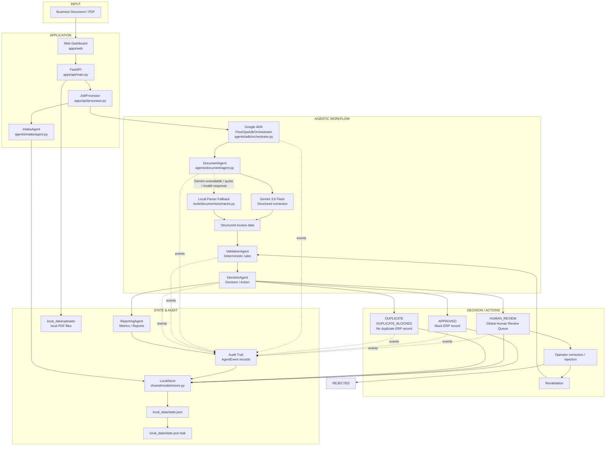
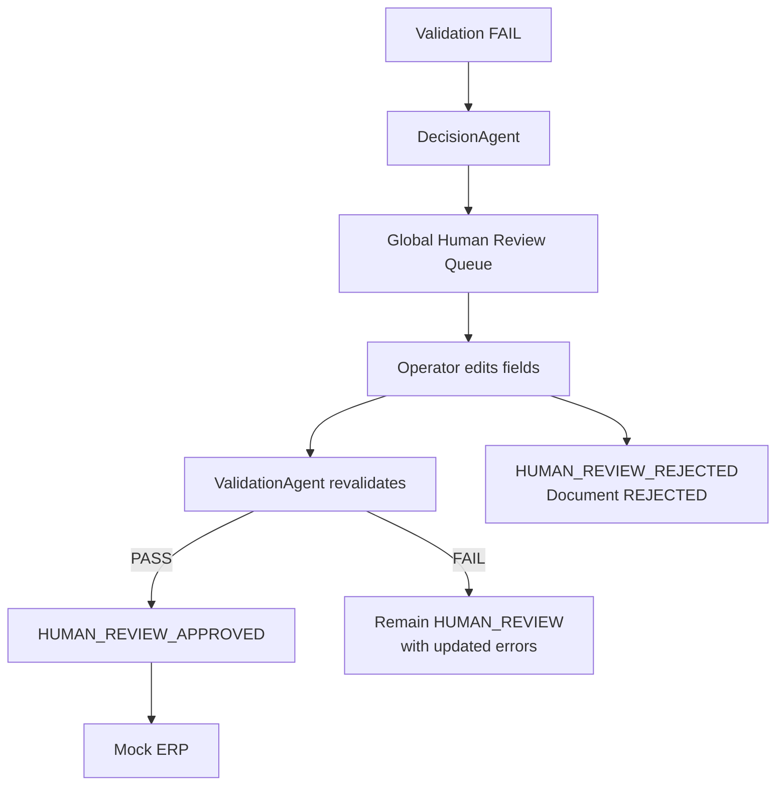
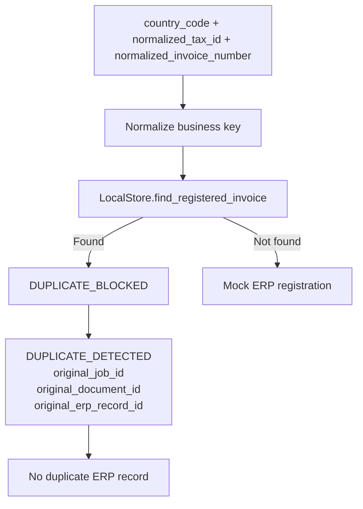
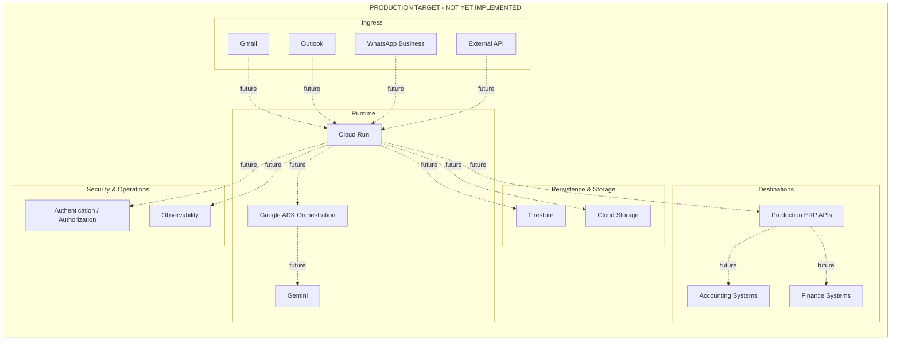

# FlowOps AI Architecture

FlowOps AI
Agentic Document Operations Architecture

Current MVP Architecture + Production Target

This document describes the architecture that exists in the repository today and separates it from the future production target. It is intended as the technical source for the official hackathon architecture diagram.

## Current MVP Architecture

## Component Responsibilities

| Component | Responsibility |
| --- | --- |
| Web Dashboard (`apps/web`) | Provides local UI for uploads, jobs, documents, Human Review, Mock ERP, and audit timeline. |
| FastAPI (`apps/api/main.py`) | Serves the dashboard and exposes job, upload, Human Review, ERP, report, and health endpoints. |
| JobProcessor (`apps/api/processor.py`) | Wires the agents together, creates upload/demo jobs, runs jobs through ADK, and resolves/rejects Human Reviews. |
| IntakeAgent (`agents/intake/agent.py`) | Creates jobs, queues documents, and records intake events. |
| Google ADK / FlowOpsAdkOrchestrator (`agents/adk/orchestrator.py`) | Starts the ADK workflow, confirms the ADK runtime when available, coordinates the existing agents, and records workflow events. |
| DocumentAgent (`agents/document/agent.py`) | Reads PDF text, calls Gemini for structured extraction, falls back to the local parser when needed, and stores extracted fields. |
| Gemini extractor (`tools/documents/gemini_extractor.py`) | Uses `google-genai` with `gemini-3.6-flash` to produce structured fiscal JSON. |
| Local parser fallback (`tools/documents/extractor.py`) | Uses local PDF/text parsing when Gemini is unavailable, over quota, or returns invalid output. |
| ValidationAgent (`agents/validation/agent.py`) | Applies deterministic validation rules and emits validation results. |
| DecisionAgent (`agents/decision/agent.py`) | Sends failed validations to Human Review, registers approved records, retries selected issues, and blocks duplicate invoices. |
| Human Review (`apps/api/processor.py`) | Allows operator correction/rejection, revalidates corrected fields, and only sends valid corrections back to DecisionAgent. |
| Mock ERP (`tools/erp/mock_erp.py`) | Builds local ERP records for approved documents. |
| ReportingAgent (`agents/reporting/agent.py`) | Refreshes job metrics and reports. |
| Audit Trail (`AgentEvent`) | Captures workflow, extraction, validation, decision, review, duplicate, ERP, and reporting events. |
| LocalStore (`shared/models/store.py`) | Persists jobs, documents, extractions, events, Human Reviews, ERP records, and counters to local JSON with backup support. |

## Multi-Country Document Intelligence

The current MVP supports a controlled `processing_region` per job:

- `AUTO`: detect Brazil or United States from document content.
- `BR`: force Brazilian validation/extraction policy.
- `US`: force United States validation/extraction policy.

`DocumentAgent` keeps the legacy `cnpj` field for backward compatibility, but stores the normalized universal document model:

- `country_code`
- `country_confidence`
- `tax_id`
- `tax_id_type`
- `company_name`
- `invoice_number`
- `issue_date`
- `total_amount`
- `currency`
- `document_type`
- `confidence`

Brazilian documents use CNPJ and BRL. United States documents use EIN/Tax ID and USD. Unknown or incomplete documents are routed to the global Human Review queue unless the operator corrects them and deterministic validation passes.

## Real Call Flow Found In Code

1. `POST /jobs/upload/run` in `apps/api/main.py` saves PDFs to `local_data/uploads/`.
2. `JobProcessor.create_upload_job()` calls `IntakeAgent.create_job()`.
3. `JobProcessor.run_job()` calls `FlowOpsAdkOrchestrator.run_job()`.
4. `FlowOpsAdkOrchestrator` records `ADK_WORKFLOW_STARTED`, optionally confirms ADK runtime, then runs the existing agents.
5. `DocumentAgent.process()` reads PDF text, calls Gemini, or uses `LOCAL_PARSER_FALLBACK`.
6. `ValidationAgent.validate()` applies deterministic validation rules.
7. `DecisionAgent.decide()` retries, creates Human Review, blocks duplicates, or creates Mock ERP records.
8. `ReportingAgent.refresh_job_metrics()` updates job status and dashboard metrics.
9. All major steps persist events through `LocalStore.add_event()`.

## Human-in-the-Loop Flow

## Duplicate Protection Flow

## Production Target

The following diagram is a future target, not the current implementation.

## Current vs Future

| Capability | Current MVP | Production Target |
| --- | --- | --- |
| Document intake | Manual dashboard upload and demo sample files | Gmail, Outlook, WhatsApp Business, and external API intake |
| Runtime | Local FastAPI/Uvicorn process | Cloud Run |
| Agent orchestration | Google ADK `FlowOpsAdkOrchestrator` in local workflow | Google ADK in deployed service architecture |
| Structured extraction | Gemini 3.6 Flash with local parser fallback | Gemini with production quota/configuration and monitoring |
| File storage | `local_data/uploads/` | Cloud Storage |
| State | `LocalStore` in `local_data/state.json` | Firestore |
| Backup/recovery | `local_data/state.json.bak` | Managed database/storage backup strategy |
| ERP destination | Mock ERP records in local state | Production ERP/accounting/finance APIs |
| Human Review | Local dashboard global queue | Authenticated operator workflow |
| Audit Trail | Local `AgentEvent` records in JSON state | Centralized observability/audit logging |
| Security | Local `.env` secrets and Git ignore rules | Authentication, authorization, secret management, monitoring |

## Current MVP Components

- Web Dashboard
- FastAPI
- JobProcessor
- IntakeAgent
- Google ADK / FlowOpsAdkOrchestrator
- DocumentAgent
- Gemini 3.6 Flash extraction
- Local Parser Fallback
- ValidationAgent
- DecisionAgent
- Global Human Review Queue
- Duplicate Blocking
- Mock ERP
- ReportingAgent
- Audit Trail
- LocalStore
- `local_data/state.json`
- `local_data/state.json.bak`
- `local_data/uploads/`

## Production Target Components

These are explicitly future components and are not implemented in RC1:

- Gmail connector
- Outlook connector
- WhatsApp Business connector
- external API ingestion
- Cloud Run
- Firestore
- Cloud Storage
- production ERP APIs
- accounting/finance system integrations
- production authentication/authorization
- production observability

## Verification Notes

- Current and future architecture are separated.
- Gemini 3.6 Flash appears as the structured extraction model in the current workflow.
- Google ADK appears as `FlowOpsAdkOrchestrator` in the current workflow.
- Human Review appears as a global queue with correction, revalidation, approval, and rejection paths.
- Duplicate Blocking appears with `DUPLICATE_BLOCKED`, `DUPLICATE_DETECTED`, and no duplicate ERP record.
- Audit Trail appears as persisted `AgentEvent` records.
- Current MVP persistence is explicitly `LocalStore`, `local_data/state.json`, `local_data/state.json.bak`, and `local_data/uploads/`.
- Cloud Run, Firestore, Cloud Storage, Gmail, Outlook, WhatsApp, and production ERP APIs are shown only in the Production Target section and marked not yet implemented.
